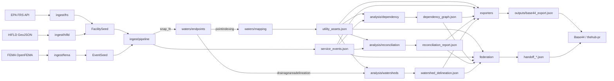

# Architecture

`aguayluz-pr` is a Puerto Rico water/power/utility infrastructure intelligence
producer for the federation control plane. It ingests public records from EPA
FRS, FEMA OpenFEMA, and HIFLD, snaps them through the EPA WATERS API to NHDPlus,
runs cross-record analysis (dependency graph + status reconciliation + watershed
delineation), and emits a sanitized Base44 envelope plus per-receiver federation
handoff payloads.

## 30-second tour

```
ingest sources       →    waters layer     →    analysis layer     →    exporters
─────────────────         ─────────────         ──────────────         ─────────
EPA FRS                   pointindexing         dependency graph        Base44 envelope
FEMA OpenFEMA             upstreamdownstream    reconciliation          federation handoffs
HIFLD GeoJSON             drainage delineation  watershed analysis      source manifest
```

The federation gates (G01–G08) sit alongside every layer, refusing exports
without source manifests, confidence scores, review queues, and sanitization.

## Layers

### 1. `waters/` — EPA WATERS REST API client

`src/aguayluz/waters/`

- **`client.py`** — `WatersClient` is the only thing in the whole codebase that
  talks to api.epa.gov/waters. Resolves the api.data.gov key from explicit arg
  → `EPA_WATERS_API_KEY` → `API_DATA_GOV_KEY` → `AuthError`. Retries 429 with
  `Retry-After` + exponential backoff. Logs `X-RateLimit-Remaining`.
- **`endpoints.py`** — typed wrappers for the 8 modern WATERS endpoints
  (`/v1/pointindexing`, `/v3/drainageareadelineation`, `/v4/upstreamdownstream`,
  etc.). All use `p`-prefixed query params per the OAS spec.
- **`mapping.py`** — `point_to_utility_asset()` turns a `pointindexing` response
  into a `UtilityAsset`. Resolves VPU from `output.ary_flowlines[0].nhdplus_region`.
  Returns `ReviewQueueItem` for out-of-PR-bbox snaps or no-flowline misses.
- **`navigation.py`** — `trace_downstream`/`trace_upstream` use `/v4/upstreamdownstream`.
  Optional `enrich_streamcat` via `pynhd` is gated by an NLDI-coverage probe.
  VPU 21 (PR) records always stamp `attribute_coverage="partial"` because the EPA
  inventory marks Vogel/VPUAttribute/NLCD as unavailable for VPU 21.

### 2. `ingest/` — public-data adapters + batched pipeline

`src/aguayluz/ingest/`

- **`pipeline.py`** — generic `FacilitySeed` (assets) and `EventSeed` (events)
  dataclasses + `ingest_seeds()` / `ingest_event_seeds()`. Per-record failure
  handling: missing coords → review queue, snap exception → review queue,
  out-of-PR-bbox → review queue, non-utility → skipped. No whole-batch failure.
- **`frs.py` + `frs_client.py`** — EPA Facility Registry Service. Real
  schema via `parse_frs_response()`; live HTTP via `fetch_facilities()` (no API
  key needed). Name-heuristic classifier covers PRASA/LUMA/WWTP/substation
  taxonomy.
- **`fema.py` + `fema_client.py`** — FEMA OpenFEMA Public Assistance v2.
  OData `$filter=stateAbbreviation eq 'PR'` syntax. Damage codes D (Water
  Control) and F (Utilities) classify as utility-relevant. Reuses FEMA's
  published `hash` field as our `source_hash`.
- **`hifld.py` + `hifld_client.py`** — HIFLD ArcGIS FeatureServer GeoJSON.
  Handles point + line + polygon geometries (lines/polygons snap from
  centroid; `geometry_type` propagates to the asset). Try-live-then-snapshot
  fallback for hub URL flakiness.

### 3. `analysis/` — cross-record analyzers

`src/aguayluz/analysis/`

- **`dependency.py`** — `build_dependency_graph()` produces typed edges
  (`same_reach`, `same_municipality`, `affects_municipality`, `shares_disaster`,
  optional `downstream_of` via WATERS).
- **`reconciliation.py`** — `reconcile()` matches assets to events by
  municipality, pulls FEMA `step=...` from event notes, classifies as
  `status_mismatch` (critical), `stale_asset` (warn), `missing_coverage` (warn),
  or `consistent` (info).
- **`watersheds.py`** — `delineate_assets()` calls
  `/v3/drainageareadelineation` per water/wastewater asset; emits
  `WatershedDelineation` records with NHDPlusID, area, bounds, and a
  GeoJSON sidecar pointer.

### 4. `exporters/` + `federation/` — sanitized handoffs

- **`src/aguayluz/exporters.py`** — `build_base44_envelope()` is the single
  canonical builder used by every vector script. Validates against the
  Base44Export Pydantic model. Refuses to emit when `sanitized_summary`
  contains key-shaped strings.
- **`src/aguayluz/federation.py`** — `build_handoff_payload(target, ...)`
  emits per-receiver projections (moneysweep gets FEMA dollars, spiderweb
  gets NHDPlus + watersheds, thehub gets contradictions + bridge summary).
- **`src/aguayluz/history.py`** — `snapshot_run()` + `diff_runs()`. Snapshots
  go under `outputs/history/<run_id>/` (gitignored). Diff surfaces
  asset/event/finding deltas with a one-line headline.

## Schemas (15 federation contracts)

JSON Schema Draft 2020-12, all `additionalProperties: false`. See
`docs/schemas.md` for one-paragraph-per-schema.

| Schema | What it carries |
|---|---|
| `utility_asset` | Asset registry record + VPU 21 partial-coverage flag |
| `service_event` | FEMA-derived service event with `notes` carrying `step=…` |
| `aguayluz_bridge_summary` | Sanitized roll-up for the federation hub |
| `base44_export` | Required envelope shape per skill spec lines 250–268 |
| `source_manifest` | Tier + access date + citation per source |
| `review_queue` | Records routed to human review |
| `integration_report` | Coverage ledger + gate report per run |
| `dependency_graph` | Typed nodes + edges (M7) |
| `reconciliation_report` | Findings + summary (M8) |
| `watershed_delineation` | Per-asset upstream watershed (M13) |
| `run_diff` | Snapshot delta (M14) |
| `federation_handoff` | Per-receiver projection (M15) |
| `hub_packet` | Self-contained signed bundle for thehub-pr (M19) |
| `foia_roster` | FOIA request targets per data gap (M20) |
| `municipality_summary` | Per-municipality dossier (M21) |

## Vectors (8 production execution modes)

See `docs/vectors.md` for inputs/outputs/CLI per vector.

```
AYL_INGEST_PUBLIC_ASSETS    →   AYL_INGEST_SERVICE_EVENTS
        ↓                                ↓
AYL_BUILD_DEPENDENCY_GRAPH   ←  AYL_RECONCILE_PROJECT_STATUS
        ↓                                ↓
AYL_DELINEATE_WATERSHEDS    →   AYL_EMIT_FEDERATION_HANDOFFS
        ↓                                ↓
AYL_TRACK_TIME_SERIES        →  AYL_EXPORT_CONTROL_PLANE
```

## Federation contract (the rules every layer respects)

From `AGUAYLUZ_PR_SKILL.md` §"Shared Rules":

1. **Vector alignment** — every run declares one active vector.
2. **0→100 coverage** — `expected / located / ingested / deduped / unresolved / gaps`.
3. **Evidence tiers T1–T4** — T1 EPA primary, T2 institutional, T3 eyewitness, T4 secondary.
4. **Confidence 0–100** with `explicit basis` — see `confidence.py`.
5. **No unsafe fielding** — no trespass, no forced access.
6. **Privacy** — sanitize PII, private addresses, witness identifiers.
7. **Base44 compatibility** — only summaries, refs, hashes, metrics, status.
8. **No silent substitution** — see VPU 21 partial-coverage flag.
9. **No silent deletion** — `review_status` + audit notes.
10. **Final output** — every run ends with an execution string.

Gates G01–G08 mechanically enforce each rule.

## Entity flow



## See also

- `docs/vectors.md` — input/output per execution vector
- `docs/schemas.md` — one paragraph per JSON Schema
- `docs/contributing.md` — how to add an adapter / analyzer / schema
- `AGUAYLUZ_PR_SKILL.md` — the federation contract this module satisfies
